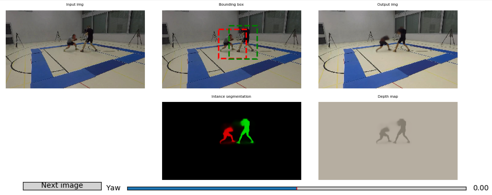

Neural Scene Decomposition for Human Motion Capture
===================

CVPR 2018 paper by Helge Rhodin, Victor Constantin, Isinsu Katircioglu, Mathieu Salzmann, Pascal Fua

https://arxiv.org/abs/1903.05684

Please cite the paper in your publications if it helps your research:

    @inproceedings{rhodin2018neural,
      author = {Rhodin, Helge and Constantin, Victor and Katircioglu Isinsu and Salzmann, Mathieu and Fua, Pascal},
      booktitle = {CVPR},
      title = {Neural Scene Decomposition for Multi-Person Motion Capture},
      year = {2019}
    }
    
Features
===================

Learning general image representations has proven key to the success of many computer vision tasks. For example, many approaches to image understanding problems rely on deep networks that were initially trained on ImageNet, mostly because the learned features are a valuable starting point to learn from limited labeled data. However, when it comes to 3D motion capture of multiple people, these features are only of limited use. 
In this paper, we introduce a self-supervised approach to learning what we call a neural scene decomposition (NSD) that can be exploited for 3D pose estimation. NSD comprises three layers of abstraction to represent human subjects: spatial layout in terms of bounding-boxes and relative depth; a 2D shape representation in terms of an instance segmentation mask; and subject-specific appearance and 3D pose information. By exploiting self-supervision coming from multiview data, our NSD model can be trained end-to-end without any 2D or 3D supervision. In contrast to previous approaches, it works for multiple persons and full-frame images. 

The provided pytorch implementation provides
-------------------

* Network definition and weights (detector, image encoder, and image decoder)
* Interactive test code
* Training code (request our Boxing dataset for training NSD on two persons)

Minimal Dependencies
===================

For testing a pre-trained model only the following packages are required:
* Pytorch 0.4 (higher versions might work as well) and torchvision
* numpy
* matplotlib
* pickle
* imageio

Moreover you will need an X Windows System (e.g.,XQuartz for mac) to run the interactive demo.

Test the pretrained model
=======================

A pre-trained model can then be tested with 
```
cd NSD/python
python configs/test_detect_encode_decode.py
```

It outputs synthesized views, detections, instance segmentation, and a relative depth map. Note that this requires an X Window System when exectued on a remote server, e.g., ssh -Y name@server.com. Different view angles can be explored interactively through slider input. It should look like this:



Training Dependencies
======================

Training your own model requires more dependencies:
* Ignite (provided in subdirectory)
* Visdom (optional, for graphical display of training progress, https://github.com/facebookresearch/visdom)
* EPFL-Boxing dataset (request it by contacting Helge Rhodin and provide the following information: Your full name, affiliation (send the email from your institutional mail address), your supervisor (professor), and your intended use case.)

Self-supervised Representation Learning 
=======================================

After downloading and file extraction, you should be able to start training by executing the following scrip from within the code root folder.
```
python configs/train_encodeDecode.py
```
There is quite a bit of debug output. Feel free to remove some if you feel like.

It will create an "output/encode_resL3_ResNet_layers4...." folder to monitor the progress (in case you don't use visdom).
Every 5k frames it will evaluate on the test set. This and other settings can be changed in configs/config_dict_encodeDecode.py

Test your model
=======================

You have to set the 'network_path' in configs/config_test_encodeDecode.py.
The trained model can then be tested as before with 
```
python configs/test_encodeDecode.py
```
You might want to change the test set in configs/test_encodeDecode.py to your own dataset.
